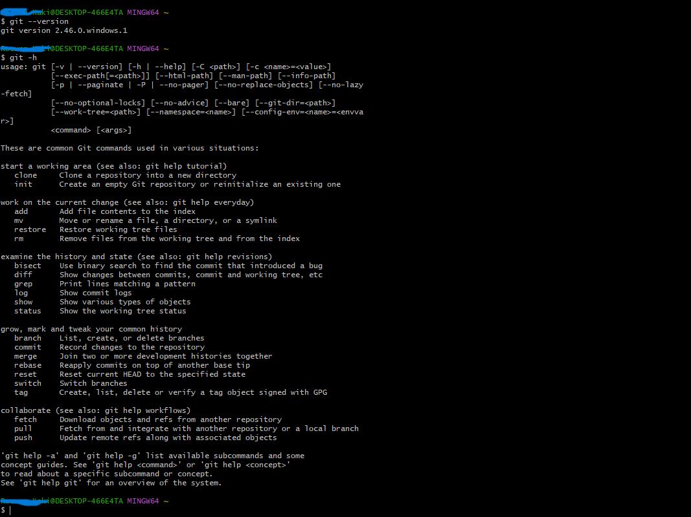

# GitHub Setup Guide for Windows

This repository contains a guide to help you set up version control using GitHub on a Windows system.

## Contents

- **[README.BASH.md](README.BASH.md):** Step-by-step instructions for setting up Git, GitHub, and SSH keys on Windows.
- **command.png:** Visual reference for key Git Bash commands.

## Quick Start

1. Follow the instructions in `README.BASH.md` to install and configure Git and GitHub.
2. Refer to `command.png` for examples of commands used in Git Bash.

---

This `README.md` provides a brief overview of the setup process and directs users to the detailed guide and visual reference.
